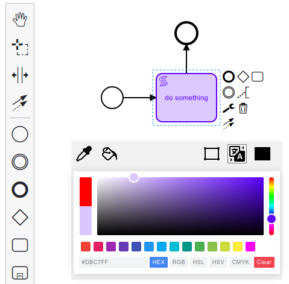

# BPMN Spectrum ColorPicker Plugin

A Spectrum Color Picker as a plugin for the Camunda Modeler.

This project was inspired by:
- https://npm.io/package/@simonwep/pickr
- https://npm.io/package/tinycolor2
- https://icons8.com/icon/pack/editing/metro

## How it looks like

## Installation
Put this directory into the `plugins` directory of the Camunda Modeler and you're ready to go.

If you're interested in how to create your own plugins see the [documentation](https://github.com/camunda/camunda-modeler/tree/547-plugins/docs/plugins) and this [example](https://github.com/camunda/camunda-modeler-plugin-example).
