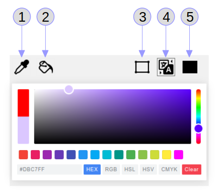

# BPMN Spectrum ColorPicker Plugin

A Spectrum Color Picker as a plugin for the Camunda Modeler.

This project was inspired by:
- https://github.com/camunda-consulting/code/tree/master/snippets/camunda-modeler-plugins/bpmn-js-plugin-color-picker

And uses:
- https://npm.io/package/@simonwep/pickr
- https://npm.io/package/tinycolor2
- https://icons8.com/icon/pack/editing/metro

## How it looks like

## Usage
Information to the used widget "Pickr" itself can be found at https://npm.io/package/@simonwep/pickr.

This Plugin uses two color types:
- fill ... for the element's background color
- stroke ... for the element's frame and text color 

### Buttons
1. pipette ... picks the colors from the selected element (if more than one are selected, the first one is elected). Both types (fill, stroke) are picked.
2. paint bucket ... pastes the colors to all selected elements. Both types (fill, stroke) are pasted.
3. frame (stroke) ... to change the element's frame and text color
4. auto (auto stroke) ... to change the element's background color; the stroke (frame) color will be set to max. color saturation
5. rectangle (fill) ... to change the element's background color

The "Clear" button sets the element's background color to "white" and frame/text color to "black".

## Installation
Put this directory into the `plugins` directory of the Camunda Modeler and you're ready to go.

If you're interested in how to create your own plugins see the [documentation](https://github.com/camunda/camunda-modeler/tree/547-plugins/docs/plugins) and this [example](https://github.com/camunda/camunda-modeler-plugin-example).
